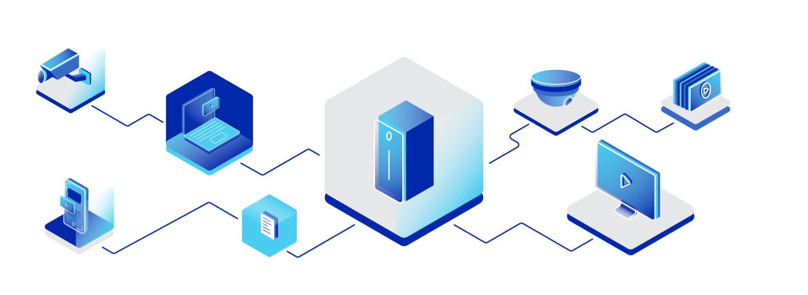
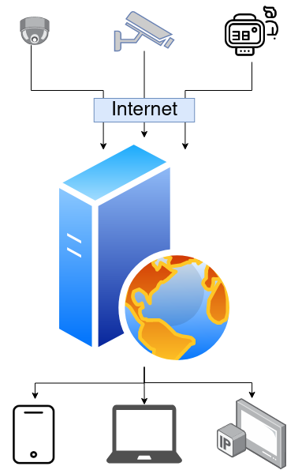

# Jak działa monitoring IP i czym jest

## Kamera IP

Żeby zrozumieć działanie monitoringu opartego o protokół IP (Internet Protocol) trzeba najpierw zrozumieć różnice między kamerami IP a analogowymi. 

Kamery analogowe do działania potrzebują lokalnego urządzenia zapisującego nagranie oraz urządzenia do wyświetlania tych nagrań. 

Kamery IP do działania potrzebują podłączenia do internetu - w ten sam sposób co telefony i komputery. Do zapisywania nagrań używane są specjalne serwery których zadaniem jest bezawaryjna praca i przetwarzanie nagrań. 
Do wyświetlenia nagrań zwykle nie są potrzebne specjalne urządzenia, a wystarczy telefon, laptop czy przeglądarka internetowa. 

W przeciwieństwie do analogowych, każda kamera wyposażona jest w mikroprocesor zdolny do kompresji danych (mniejsze zużycie internetu), prostego przegtwarzania obrazu.
## Serwer

Serwer pełni kluczową funkcję w systemie. Jest to jednostka centralna wyposażona w potężne procesory i ogromne ilości przestrzeni dyskowej. Jego zadaniem jest łączenie się z dowolną ilością kamer i zapewnienie:

- Zapisu nagrań i dostępu do nich
- Analizę nagrań na żywo (poszukiwanie osób, rozpoznawanie tablic rejestracyjnych i wiele więcej)
- Wyszukiwanie konkretnych zdażeń w nagraniu (moment przekroczenia strefy niedozwolonej, za długi postój i wiele więcej)
- Przesyłanie powiadomień 

Jednym zdaniem serwer jest mózgiem całego systemu. Komunikacja z kamerami i aplikacjami klienckimi może się odbywać z dowolnego zakątka świata. 
Dzięki zastosowaniu nowoczesnych rozwiązań wyeliminowano problemy poprzedniej generacji systemów (analogowych) takie jak: 

- Brak rejestratora :arrow_right: w przypadku włamania twoje nagrania i dowody są bezpieczne oraz nie ma obawy o ich utratę
- Redundantny zapis nagrań :arrow_right: dzięki zapisowi tych samych danych wielokrotnie awaria dysku nie powoduje żadnej straty
- Zdalny dostęp z dowolnego miejsca :arrow_right: poprzez internet natychmiastowy dostęp wszędzie jest standardem
- Informowanie operatora :arrow_right: Nowoczesne algorytmy skutecznie poprawiają efektywność operatora i ułatwiają jego zadania

Model systemu został zaprezentowany poniżej:

## Klient

Klientem w systemie jest urządzenie za pomocą którego realizowana jest kontrola/dostęp do systemu. Czyli może to być telefon lub komputer z zainstalowaną specjalną aplikacją, telewizor wyświetlający obraz z kamer czy strona internetowa otwarta na urządzeniu. 

---

_by Adam Krawczyk, visevision_

_Jeżeli chcesz dowiedzieć się więcej to śmiało napisz do nas, a postaramy się wyjaśnić i doradzić. Kontakt: support@wisevision.com.pl_