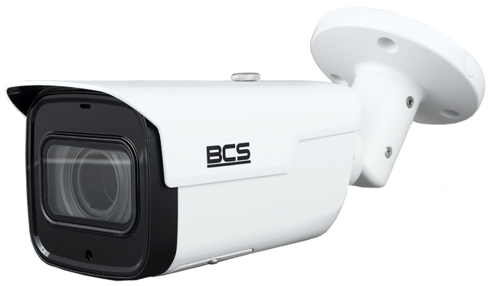

# Oferta monitoringu farmy fotowoltaicznej 2021-2022

## Dlaczego warto skorzystać

#### - Bezpieczeństwo danych dzięki przechowywaniu w prywatnej chmurze

#### - Zdalny podgląd z dowolnego miejsca

#### - Dostęp przez przeglądarkę i aplikację na telefon (IOS/Android)

#### - Inteligentna analiza obrazu wspierająca bezpieczeństwo

## Proponowany sprzęt

Proponowane przez nas rozwiązanie zgodne jest jedynie z kamerami marki **BCS**, sugerowane przez nas kamery znajdują się poniżej. Możliwy jest wybór innej kamery w sklepie _www.ivel.pl_, na kamery realizujemy zniżkę **-30%** od ceny katalogowej.

---

|                                                                                                                                   |                                                                                 |
| :-------------------------------------------------------------------------------------------------------------------------------- | ------------------------------------------------------------------------------: |
| Sugerowana kamera:                                                                                                                |                                                                                 |
| BCS-TIP5501IR-V-VI Cena katalogowa 1248.94 zł netto Cena oferowana **874.26 zł netto**                                            |                                                                                 |
| - Rozdzielczość: 5 Mpx - Zasięg widzenia w nocy: 60m - Warunki pracy: -30°C ~ +60°C, IP66                                         |  |
|                                                                                                                                   |                                                                                 |
| Sugerowana kamera termowizyjna:                                                                                                   |                                                                                 |
| BCS-TIP4220807IR-TW Cena katalogowa 6150.76 netto Cena oferowana **4305.54 zł netto**                                             |                                                                                 |
| - Rozdzielczość: 2 Mpx - Zasięg widzenia w nocy: 50m - Warunki pracy: -30°C ~ +60°C, IP66 - Możliwość wykrycia uszkodzenia paneli |  |
|                                                                                                                                   |                                                                                 |

\*Oferowana usługa podstawowej analizy obrazu działa tylko z wybranymi kamerami BCS.

## Zalety usługi chmurowej

Prywatna chmura jest to usługa obliczeniowe oferowana za pośrednictwem Internetu wyłącznie wybranym użytkownikom, a nie ogółowi społeczeństwa. Prywatna chmura zapewnia korzyści - w tym samoobsługę, skalowalność, szybkość działania i elastyczność. Ponadto chmura prywatna zapewnia wyższy poziom zabezpieczeń i prywatności za pośrednictwem zarówno zapór, jak i hostowania wewnętrznego, aby operacje i poufne dane nie były dostępne dla nikogo niepowołanego.

Różnica w monitoringu między rozwiązaniem klasycznym a chmurowym polega na tym, że wszystkie niezbędne obliczenia związane zapisem, odczytem czy analizą obrazu wykonywane są na przystosowanych do tego celu serwerach, a nie rejestratorach lokalnie. Dedykowane procesory i dyski do pracy ciągłej zapewniają nieprzerwany dostęp i zmniejszają częstotliwość awarii. W związku z przechowywaniem danych w prywatnej chmurze zdecydowanie spada ryzyko utraty danych (dane są powielane), nie ma obawy, że w czasie napadu zostanie uszkodzony rejestrator a tym samym wszystkie nagrania utracone. Dzięki szyfrowaniu zniwelowane jest ryzyko nieuprawnionego dostępu do nagrań przez osoby trzecie. W przypadku awarii internetu kamery zapisują dane na pamięć wewnętrzną, a po odzyskaniu połączenia następuje synchronizacja brakujących nagrań.

- Brak ryzyka kradzieży rejestratora
- Minimalizacja ryzyka awarii dysku
- Gwarancja ciągłości pracy
- Szybkość działania
- Dostęp z całego świata

## Cennik

Prezentowane ceny dotyczą jednej kamery przy umowie na :stopwatch: 5 lat (60 miesięcy) :stopwatch:

---

| Nazwa                                                     | Cena netto (przy opłacie jednorazowej) | Cena brutto (przy opłacie jednorazowej) | Cena netto w abonamencie miesięcznym |
| :-------------------------------------------------------- | --------------------------------: | ---------------------------------: | -----------------------------------: |
| Usługa przechowywania danych w chmurze i zdalnego dostępu |         1620 zł (30 zł / miesiąc) |                          2337.6 zł |                   33.34 zł / miesiąc |
| Kamera (BCS)                                              |                         874.26 zł |                          1135.4 zł |                   14.58 zł / miesiąc |
| Kamera termowizyjna (BCS)                                 |                        4305.54 zł |                          5591.6 zł |                   71.78 zł / miesiąc |
| [Podstawowa analiza obrazu (BCS)](#podstawowa-analiza-obrazu)                           |                              0 zł |                               0 zł |                                 0 zł |
| [Zaawansowana analiza obrazu](#zaawansowana-analiza-obrazu)                               |         2700 zł (45 zł / miesiąc) |                          3506.5 zł |                      50 zł / miesiąc |
| Montaż                                                    |               Indywidualna wycena |                Indywidualna wycena |                  Indywidualna wycena |
| Serwis                                                    |                              0 zł |                               0 zł |                                 0 zł |
| Wsparcie techniczne                                       |                              0 zł |                               0 zł |                                 0 zł |
| Wymiana na sprzęt nowej generacji po okresie 5 lat        |                              1 zł |                            1.23 zł |                                 1 zł |

\*Do ceny netto należy doliczyć + 23% VAT.

## Podstawowa analiza obrazu

W ramach podstawowej **analizy obrazu** oferujemy następujące funkcjonalności:

- Przekroczenie linii (powiadomienie, gdy jakaś osoba przekroczy wirtualną linię)
- Intruz (powiadomienie, gdy jakaś osoba znajdzie się w wyznaczonym polu)
- Porzucony przedmiot
- Brakujący przedmiot
- Detekcja ruchu
- Detekcja naruszenia wideo, czyli próby rozmycia/wstawienia zdjęcia
- Detekcja zasłonięcia obiektywu

Dodatkowo dla kamery termowizyjnej:

- Detekcja pożaru i alarm
- Powiadomienie o przekroczeniu zadanej temperatury
- Śledzenie najcieplejszego/najzimniejszego punktu
- Detekcja osoby w całkowitym mroku

Dla wszystkich funkcji możliwe jest ustawienie dni tygodnia i godzin, w które mają być aktywne. Użytkownik dostaje odpowiednie powiadomienie razem ze zdjęciem przez e-mail.

Do dyspozycji użytkownika znajdują się też funkcje **wyszukiwania w nagraniu** sprecyzowanych zdarzeń takich jak:

- Wyszukiwanie twarzy
- Detekcja osób
- Wykrywanie pojazdów

## Zaawansowana analiza obrazu

Jest to rozwiązanie oparte o sztuczną inteligencję realizowane na serwerach, wymagające dużych mocy obliczeniowych, ale zapewniające unikalne funkcje.

Do działania **nie są wymagane specjalne kamery**, a jedynie takie, które obsługują technologię Onvif oraz kodowanie H265.

Do funkcji należą:

- Detekcja ruchu na obrazie
- Detekcja niestandardowych zmian
- Śledzenie osób i obiektów
- Rozpoznawanie tablic rejestacyjnych
- Rozpoznawanie numerów pojazdów torowych
- Rozpoznawanie twarzy
- Wyszukiwanie twarzy w nagraniu
- Detekcja ognia
- Detekcja dymu
- Detekcja zachowania osób i ich postawy (np. upadek na ziemię)
- Wykrywanie środków ochrony osobistej
- Liczenie osób na danym obszaże
- Liczenie osób odwiedzających
- Mapy ciepła (zagęszczenie osób, najpopularniejsze miejsca)

## Na wypadek awarii

W przypadku awarii przewidziany maksymalny czas reakcji wynosi **48 godzin**. Czas reakcji oznacza maksymalny czas przystąpienia do wykonania czynności serwisowych, licząc od momentu zgłoszenia awarii lub usterki.

Awarie kamer realizowane są poprzez zastąpienie takim samym urządzeniem, a dopiero późniejszą procedurę gwarancyjną - tak żeby zapewnić możliwie ciągłą pracę systemu.

Każda kamera wyposażona jest w wewnętrzną pamięć i w przypadku awarii połączenia internetowego nagrania są zapisywane lokalnie, a po odzyskaniu połączenia następuje przesłanie brakujących nagrań.

## Wymagania infrastruktury:

- Zasilanie 230V
- Połączenie internetowe (3.5 Mbit/s dla kamery), dla jakości Full HD (1920x1080) 25 fps (Standardowo).

&copy; 2021 Inter Plus sp. z o.o. ul. Świętokrzyska 30/63 00-116 Warszawa

Oddział Chełm:

ul. Popiełuszki 13, piętro 3
22-100 Chełm

Tel. Adam: 790-703-025

Tel. Łukasz: 530-615-552

email.: office@wisevision.com.pl , adam.krawczyk@inter-plus.eu

<!-- pandoc farma_fotowoltaiczna_html.md -o wisevision_oferta_monitoringu_farma_fotowoltaiczna_2021.pdf --pdf-engine=wkhtmltopdf -->
